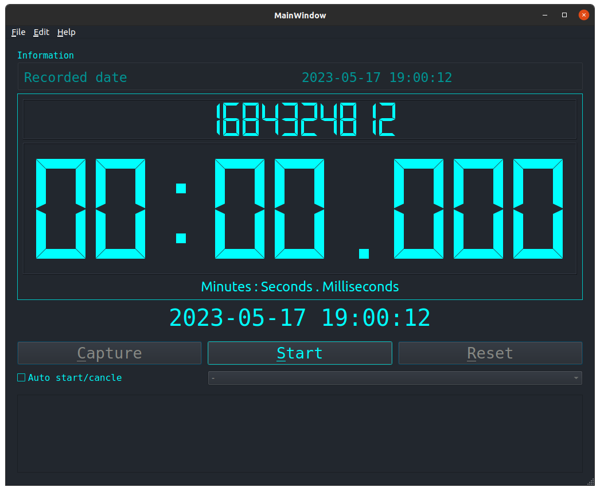

# Stopwatch

This application is a digital stopwatch GUI application that is based on the PyQt5 framework. It offers two modes of operation: manual and automatic. In the manual mode, users can interact with the stopwatch by pressing the button in the GUI window. On the other hand, the automatic mode allows users to control the stopwatch by sending a toggle message through either the ROS or MQTT protocol.

<div align="center">
    
</div>


The following sections provide information on how to install and how to use it.

---

## Installation

### Dependencies:

- [x] ROS Neotic
- [x] Mosquitto MQTT
- [x] mosquitto-client
- [x] Python version > 3.7
    - catkin_pkg==0.5.2
    - paho_mqtt==1.6.1
    - PyQt5==5.15.9
    - rospy==1.16.0

1. Clone the repository.

```sh
git clone xxx

2. Install the needed library from the requirements.txt file.

```sh
pip install -r requirements.txt 
#or
pip3 install -r requirements.txt
```

---

## How to use

xxx


